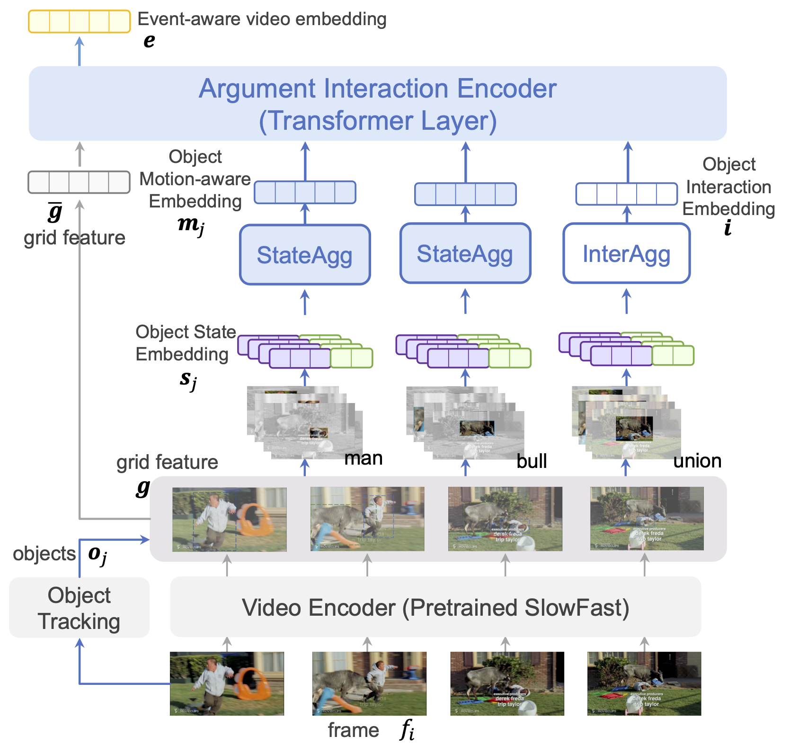

# Video Event Extraction via Tracking Visual States of Arguments
[](./LICENSE)
[](https://www.python.org/)


**[Video Evnet Extraction via Tracking Visual States of Arguments](https://arxiv.org/pdf/2211.01781.pdf)**<br>
Guang Yang, Manling Li, Jiajie Zhang, Xudong Lin, Shih-Fu Chang, Heng Ji<br>
AAAI 2023 <br>

Video event extraction aims to detect salient events from a video and identify the arguments for each event as well as their semantic roles. Inspired by the definition of events as changes of  states, we propose a novel framework to detect video events by tracking the changes in the visual states of all involved arguments, which are expected to provide the most informative evidence for the extraction of video events. In order to capture the visual state changes of arguments, we decompose them into changes in pixels within objects, displacements of objects, and interactions among multiple arguments. We further propose Object State Embedding, Object Motion-aware Embedding and Argument Interaction Embedding to encode and track these changes respectively.



This repository includes:

1. Instructions to install, download and process VidSitu Dataset.
2. Code to run all experiments provided in the paper along with log files.

This repository is built upon the [VidSitu repository](https://github.com/facebookresearch/SlowFast/tree/312366920a394e0a984e7d731077ca74e9f7abe6).

# Download

Please see [DATA_PREP.md](./data/DATA_PREP.md) for detailed instructions on downloading and setting up the VidSitu dataset.

To reproduce our result, you also need to download the pre-trained SlowFast weights:
```
export ROOT=$(pwd)
mkdir $ROOT/weights
cd $ROOT/weights
wget -c https://dl.fbaipublicfiles.com/pyslowfast/model_zoo/kinetics400/SLOWFAST_8x8_R50.pkl
```

You could also referr to [SlowFast Model Zoo](https://github.com/facebookresearch/SlowFast/blob/312366920a394e0a984e7d731077ca74e9f7abe6/MODEL_ZOO.md) for more 
pretrained models.

# Installation

Please see [INSTALL.md](./INSTALL.md) for detailed instructions

# Training

- Basic usage is `CUDA_VISIBLE_DEVICES=$GPUS python main_dist.py "experiment_name" --arg1=val1 --arg2=val2` and the arg1, arg2 can be found in `configs/vsitu_cfg.yml`.

- Set `$GPUS=0` for single gpu training. For multi-gpu training via Pytorch Distributed Data Parallel use `$GPUS=0,1,2,3`

- YML has a hierarchical structure which is supported using `.`
    For instance, if you want to change the `beam_size` under `gen` which in the YML file looks like
    ```
    gen:
        beam_size: 1
    ```
    you can pass `--gen.beam_size=5`

- Sometimes it might be easier to directly change the default setting in `configs/vsitu_cfg.yml` itself.

- To keep the code modular, some configurations are set in `code/extended_config.py` as well.

- All model choices are available under `code/mdl_selector.py`

## Verb Classification

Here are the bash commands to train our three models:

- OSE-pixel + OME:
    ```
    CUDA_VISIBLE_DEVICES=0,1,2,3 python main_dist.py "OSE-pixel_OME" --mdl.mdl_name="sf_ec_cat" \
        --train.bs=8 --train.gradient_accumulation=1 --train.nw=8 --train.bsv=16 --train.lr=3e-5 --mdl.C=0\
        --train.resume=False --mdl.load_sf_pretrained=True  \
        --do_dist=True
    ```

- OSE-pixel/disp + OME:
    ```
    CUDA_VISIBLE_DEVICES=0,1,2,3 python main_dist.py "OSE-pixel-disp_OME" --mdl.mdl_name="sf_ec_cat" \
        --train.bs=8 --train.gradient_accumulation=1 --train.nw=8 --train.bsv=16 --train.lr=3e-5 --mdl.C=128\
        --train.resume=False --mdl.load_sf_pretrained=True  \
        --do_dist=True
    ```

- OSE-pixel/disp + OME + OIE:
    ```
    CUDA_VISIBLE_DEVICES=0,1,2,3 python main_dist.py "OSE-pixel-disp_OME_OIE" --mdl.mdl_name="sf_ec_rel" \
        --train.bs=4 --train.gradient_accumulation=1 --train.nw=8 --train.bsv=16 --train.lr=3e-5 --mdl.C=128\
        --train.resume=False --mdl.load_sf_pretrained=True  \
        --do_dist=True
    ```

After training verb classification model,
run the following commands to extract features for all videos:
```
CUDA_VISIBLE_DEVICES=0,1,2,3 python vidsitu_code/feat_extractor.py --mdl_resume_path='tmp/models/OSE-pixel_OME/best_mdl.pth' \
	--mdl_name_used='OSE-pixel_OME' --mdl.mdl_name='sf_ec_cat' --is_cu=False --mdl.C=0 \
	--train.bsv=16 --train.nwv=16
```

## Semantic Role Prediction

For semantic role prediction,
we can set the random seeds.
To reproduce our results on semantic role prediction,
set the random seeds to $\{17, 33, 66, 74, 98, 137, 265, 314, 590, 788\}$.

For example, to reproduce the experiments with "OSE-pixel + OME" features, the commands are:
```
for seed in 17 33 66 74 98 137 265 314 590 788
do
    CUDA_VISIBLE_DEVICES=1 python main_dist.py "OSE-pixel_OME_arg_${seed}" --task_type="vb_arg" \
        --train.bs=16 --train.bsv=16 --mdl.mdl_name="sfpret_txe_txd_vbarg" \
        --tx_dec.decoder_layers=3 --tx_dec.encoder_layers=3 --mdl.C=0 \
        --ds.vsitu.vsit_frm_feats_dir="./data/vsitu_vid_feats/OSE-pixel_OME" \
        --debug_mode=False --seed=$seed
done
```


# Logging

Logs are stored inside `tmp/` directory. When you run the code with $exp_name the following are stored:
- `txt_logs/$exp_name.txt`: the config used and the training, validation losses after ever epoch.
- `models/$exp_name.pth`: the model, optimizer, scheduler, accuracy, number of epochs and iterations completed are stored. Only the best model upto the current epoch is stored.
- `ext_logs/$exp_name.txt`: this uses the `logging` module of python to store the `logger.debug` outputs printed. Mainly used for debugging.
- `predictions`: the validation outputs of current best model.

Logs are also stored using [MLFlow](https://www.mlflow.org/docs/latest/tracking.html). These can be uploaded to other experiment trackers such as [neptune.ai](https://neptune.ai/), [wandb](https://wandb.ai/site) for better visualization of results.
